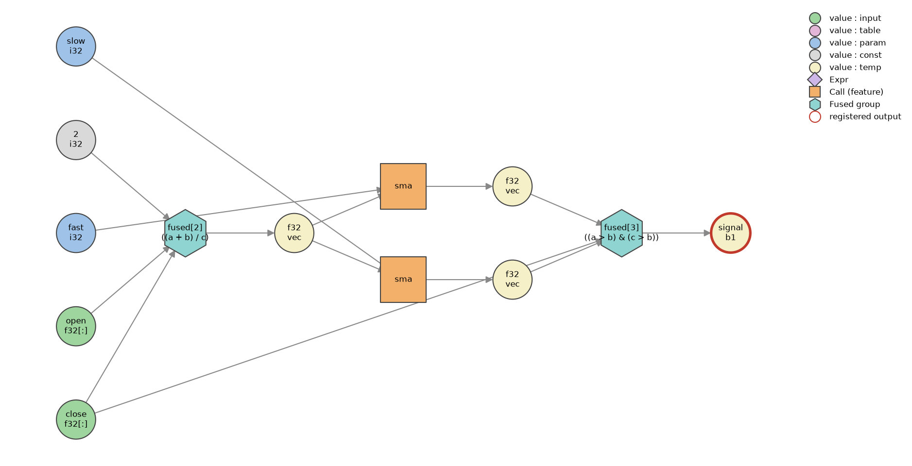
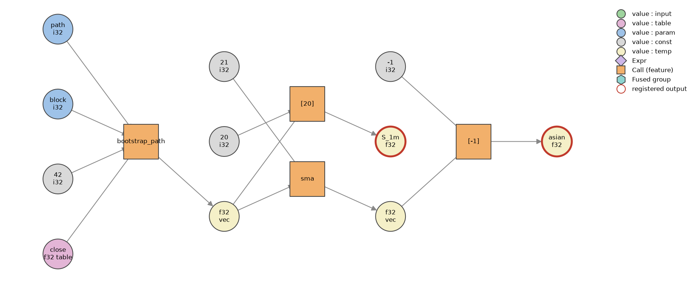
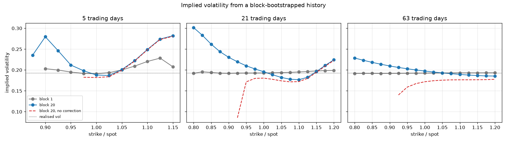
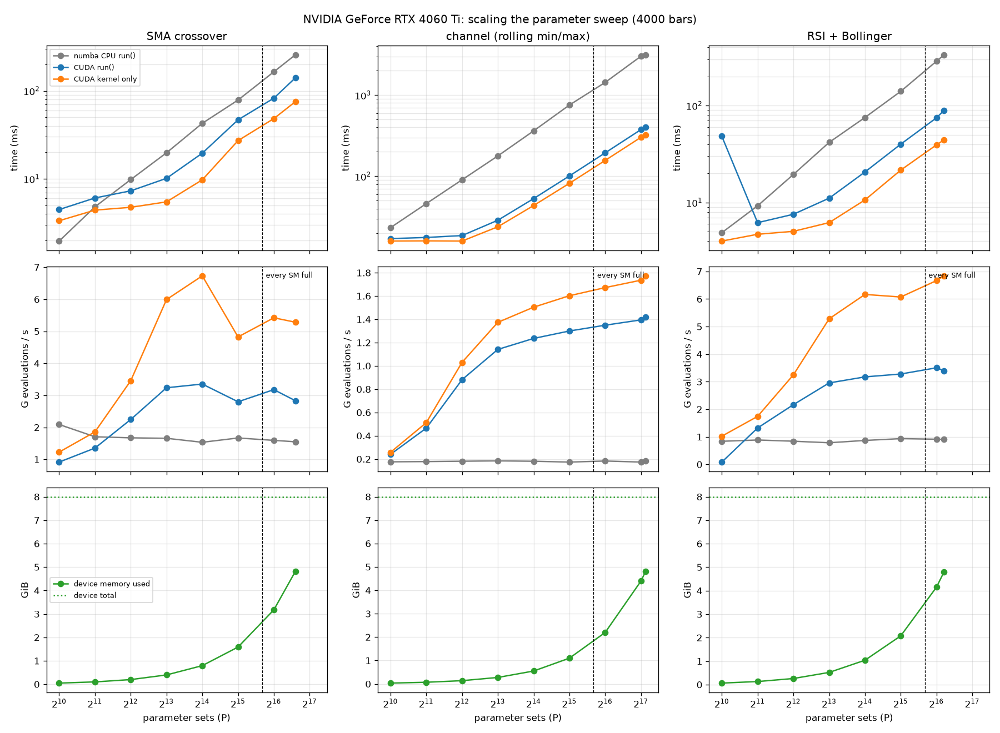

# KernelSmith

> Write trading strategies as Python expressions — compile them into fused CUDA kernels.

[](https://github.com/msanthosh247/KernelSmith/actions/workflows/ci.yml)

**Status: early development, working end to end.** A typed DSL, an optimizer (CSE, fusion, liveness, buffer allocation), and two generating backends — parallel CPU and CUDA — compiling the same graph from the same kernel sources. A library of common indicators, and tables for simulation. The roadmap below says what does not exist yet.

## What it is

KernelSmith is a small compiler for parameter-sweep workloads: backtests, and Monte Carlo simulation. You describe a strategy once as a dataflow graph; the compiler schedules it, plans its memory, and generates one fused kernel that evaluates thousands of parameter combinations in parallel — one GPU thread (or one CPU core's loop iteration) per parameter set, with buffer layouts chosen per target.

The graph is **value-centric SSA**: every value is created exactly once by its producer, which makes output overwrites and dependency cycles unrepresentable by construction — a whole class of framework bugs ruled out before any pass runs.

```python
import numpy as np
from kernelsmith import Graph
from kernelsmith.backends.numba_cpu import NumbaCPU_Backend   # or CudaBackend: same interface
from kernelsmith.features import sma

g = Graph()
close, opn = g.register_input("close"), g.register_input("open")
fast, slow = g.int_param("fast"), g.int_param("slow")

med    = (close + opn) / 2                   # operators build typed graph nodes
trend  = sma(med, fast) > sma(med, slow)
signal = trend & (close > sma(med, slow))    # sma(med, slow) written twice: computed once
g.register_output("signal", signal)

rng = np.random.default_rng(7)
close_prices = (np.cumsum(rng.normal(0, 1, 250)) + 100).astype(np.float32)
open_prices = close_prices + rng.normal(0, 0.2, 250).astype(np.float32)

program = NumbaCPU_Backend().compile(g)      # lower, optimise, emit, compile one kernel
out = program.run(
    inputs={"close": close_prices, "open": open_prices},
    params={"fast": [5, 10, 20], "slow": [20, 50, 100]},   # three parameter sets
)
print(out["signal"].shape)                   # (3, 250): parameter sets x bars
```

`g.visualize()` draws the graph as written:


Mistakes fail when the graph is built, with messages that say what you probably meant:

<!-- generated:type-errors -->
```
>>> (close + opn) & close
DslTypeError: '&' requires bool operands, got float32 and float32 - did you mean a comparison?

>>> history * 2
DslTypeError: 'history' is a table (reference data): it can only be passed to features such as bootstrap_path. To compute on it bar by bar, register it with register_input.

>>> bootstrap_path(close, 20, 0, 42)
DslTypeError: 'bootstrap_path' argument 0 expects a table (float32.table), got the series 'close' (float32[:]). Register it with register_table: a series sits on the graph's time axis, so every output would be as long as it.
```
<!-- /generated -->

## What the compiler decided

`explain_graph(g)` runs the whole pipeline and reports it — the schedule, each op's dependency level, which buffer every result lives in, and the pools those buffers come from:

<!-- generated:schedule -->
```
4 ops   2 input(s)   2 param(s)   1 output(s)

op  lvl  kind  name              outs                          scratch
--- ---- ----- ----------------- ----------------------------- -------------
0   0    fused fused[2]          T:f32v[0]                     -
1   1    call  sma               T:f32v[1]                     -
2   1    call  sma               T:f32v[2]                     -
3   2    fused fused[3]          O:b1v[0]                      -

pools:
  output/bool/vector  x1
  temp/float32/vector  x3
```
<!-- /generated -->

<!-- generated:summary -->
**8 operations were written; 4 run.** CSE removed 1 duplicate call, and fusion merged 5 elementwise operations into 2 loops.
<!-- /generated -->
Fused operations share one loop, so their intermediates are registers rather than buffers — which is why there is no `temp/bool` pool at all. The three float buffers that remain are recycled the moment a value's live interval ends.

The same schedule as a picture — hand `visualize()` the ops from the passes, and the difference from the graph above is what the compiler removed:



Hexagons are fused groups, labelled with the expression they evaluate in one pass.

### What it emitted

The CUDA backend turns that schedule into one kernel — a thread per parameter set, `p` its index:

<!-- generated:cuda-source -->
```python
@cuda.jit
def kernel(inp_f32, par_i32, out_b1_v, tmp_f32_v, n_params, n_bars):
    p = cuda.grid(1)
    if p < n_params:
        for t in range(n_bars):
            _v0 = (inp_f32[t, 0]) + (inp_f32[t, 1])
            tmp_f32_v[t, 0, p] = (_v0) / (np.float32(2.0))
        sma_cuda(tmp_f32_v[:, 0, p], par_i32[1, p], tmp_f32_v[:, 1, p])
        sma_cuda(tmp_f32_v[:, 0, p], par_i32[0, p], tmp_f32_v[:, 2, p])
        for t in range(n_bars):
            _v0 = (inp_f32[t, 0]) > (tmp_f32_v[t, 1, p])
            _v1 = (tmp_f32_v[t, 2, p]) > (tmp_f32_v[t, 1, p])
            out_b1_v[t, 0, p] = (_v1) & (_v0)
```
<!-- /generated -->

Two decisions are visible in it:
- **Parameter set innermost** (`tmp_f32_v[t, slot, p]`): the 32 threads of a warp touch 32 adjacent addresses, one memory transaction instead of 32.
- **Every constant typed** (`np.float32(2.0)`): a bare `2` would be int64 to numba and turn the division into float64, which a GeForce GPU runs at 1/64 of the float32 rate. A test reads the compiled PTX and fails on any float64 instruction.

The CPU backend emits the same schedule with the layout flipped — series contiguous per core — and `prange` in place of the thread index. Both compile the same feature kernels, written once as plain Python loops.

## Features

Kernels are the features that need their own loop; indicators are compositions of them that the compiler fuses like any other arithmetic. Every kernel has a numpy reference implementation, and every backend is tested against it.

<!-- generated:features -->
| | feature | what it computes |
|---|---|---|
| kernel | `sma(float32[:], int32) -> float32[:]` | Simple moving average over `period` bars |
| kernel | `ema(float32[:], int32) -> float32[:]` | Exponential moving average, alpha = 2 / (period + 1), seeded with the first `period` mean |
| kernel | `rma(float32[:], int32) -> float32[:]` | Wilder's smoothing - an EMA with alpha = 1 / period (ATR, RSI, ADX) |
| kernel | `wma(float32[:], int32) -> float32[:]` | Linearly weighted: the newest element weighs `period`, the oldest 1 |
| kernel | `rolling_sum(float32[:], int32) -> float32[:]` | Sum over the last `period` bars |
| kernel | `rolling_std(float32[:], int32) -> float32[:]` | Population standard deviation (ddof=0), the Bollinger convention |
| kernel | `mean_deviation(float32[:], int32) -> float32[:]` | Mean absolute deviation from the window mean (the CCI denominator) |
| kernel | `rsi(float32[:], int32) -> float32[:]` | Wilder's RSI: average gain and loss seeded over the first `period` changes, then smoothed with alpha = 1 / period |
| kernel | `stochastic_k(float32[:], float32[:], float32[:], int32) -> float32[:]` | Fast %K: where the close sits in the window's high-low range, 0..100 |
| kernel | `true_range(float32[:], float32[:], float32[:]) -> float32[:]` | The bar's range, stretched to cover a gap from the previous close |
| kernel | `adx(float32[:], float32[:], float32[:], int32) -> float32[:], float32[:], float32[:]` | Wilder's directional movement system |
| kernel | `rolling_min_max(float32[:], int32) -> float32[:], float32[:]` | Lowest and highest value over the last `period` bars (Donchian channel) |
| kernel | `rolling_arg_min_max(float32[:], int32) -> float32[:], float32[:]` | Bars since the window's lowest and highest element (0 = this bar) |
| kernel | `shift(float32[:], int32) -> float32[:]` | `values` delayed by `period` bars |
| kernel | `bootstrap_path(float32.table, int32, int32, int32) -> float32[:]` | One simulated future path by circular moving-block bootstrap |
| indicator | `atr` | Average true range: Wilder's smoothing of the true range |
| indicator | `bollinger` | (lower, middle, upper): the SMA, plus and minus `width` population standard deviations over the same window |
| indicator | `cci` | Commodity channel index over the typical price (high + low + close) / 3 |
| indicator | `cross_over` | True on the bar `a` moves from at-or-below `b` to above it |
| indicator | `cross_under` | True on the bar `a` moves from at-or-above `b` to below it |
| indicator | `donchian` | (lower, middle, upper): the lowest low and highest high over `period` |
| indicator | `keltner` | (lower, middle, upper): the close's EMA, plus and minus `multiplier` ATRs |
| indicator | `macd` | (line, signal, histogram): fast EMA minus slow EMA, its own EMA, and the gap between them |
| indicator | `momentum` | Change over `period` bars |
| indicator | `roc` | Rate of change over `period` bars, in percent |
| indicator | `stochastic` | (%K, %D): fast %K and its `d_period` simple average |
| indicator | `williams_r` | Williams %R, -100..0: %K shifted down by 100 |
| indicator | `zscore` | How many standard deviations `values` sits from its moving average |
<!-- /generated -->

## Adding a feature

A feature is three things: a **signature**, a **numpy reference implementation**, and **one kernel body** that every generating backend compiles. Here is a complete one — drawdown from the running peak — defined outside the library, the way you would in your own code:

```python
from numba import njit
from kernelsmith import CallFactory, F4
from kernelsmith.backends.cpu import CPUBackend, cpu_impl
from kernelsmith.backends.numba_cpu import register_numba_cpu

# 1. the signature: the single source of truth for its types - every
#    implementation is checked against it when it is registered
drawdown = CallFactory("drawdown", input_signature=[F4[:]],
                       buffer_signature=[], output_signature=[F4[:]])

# 2. the reference: numpy, written from the definition, obvious over fast.
#    Returns a tuple, one entry per output.
@cpu_impl(drawdown)
def _drawdown_reference(values):
    values = np.asarray(values, dtype=np.float64)
    return ((values / np.maximum.accumulate(values) - 1).astype(np.float32),)

# 3. the kernel: plain loops, inputs then outputs, every element written
def drawdown_kernel(values, out):
    peak = values[0]
    for i in range(values.shape[0]):
        peak = max(peak, values[i])
        out[i] = values[i] / peak - np.float32(1.0)

register_numba_cpu(drawdown)(njit(drawdown_kernel))
# and on the GPU, the same body:
#   register_cuda(drawdown)(cuda.jit(device=True)(drawdown_kernel))

# it is now a feature like any other: typed, fused around, compiled in
dd = Graph()
price = dd.register_input("close")
dd.register_output("deep", drawdown(price) < -0.05)

compiled = NumbaCPU_Backend().compile(dd).run({"close": close_prices}, {})
reference = CPUBackend().compile(dd).run({"close": close_prices}, {})
assert (compiled["deep"] == reference["deep"]).all()
```

The kernel is what needs care. The contract, from [`features/kernels.py`](src/kernelsmith/features/kernels.py):

- **Plain loops only.** No whole-array numpy calls, no allocation, no Python objects — a CUDA device function supports none of them. That is what lets one body compile everywhere.
- **Write every element of every output, on every path**, NaN where there is no answer. Buffers are recycled between ops and runs and never cleared, so an element you skip keeps the previous tenant's value.
- **Do not assume contiguity.** On the GPU a series is a strided column.
- **Spell out every type.** A bare `1.0` is float64 to numba and a bare `1` is int64; either widens everything it touches, and on a GeForce GPU float64 runs at 1/64 speed. Hence `np.float32(1.0)` above.

Contributing a feature to the library itself follows the same three steps, with conventions that make it hold up across the whole library:

1. **Signature** in [`features/specs.py`](src/kernelsmith/features/specs.py), added to `FEATURES` — every backend registers its kernel from that list, so there is no per-backend step.
2. **Kernel** in `kernels.py` as `<name>_kernel`. Write scalars as `FLOAT(...)` / `INT(...)`: the CPU build binds them to float64/int64, the CUDA build to float32/int32. Keep one loop over time with the warm-up predicated inside it (a warp's threads then stay in step), skip leading NaNs with `first_valid` so the feature can be applied to another feature's output, and Kahan-compensate any running sum (`_kahan`, free in the float64 build).
3. **Reference** in [`features/numpy_impl.py`](src/kernelsmith/features/numpy_impl.py): from the definition, never a transcription of the kernel's sliding update — the point is that the two cannot share a bug. A feature whose output length is not its input's (a simulation from a table) takes a keyword-only `n_bars`.
4. **Tests**: add a line to `FEATURES` in [`tests/test_indicators.py`](tests/test_indicators.py) — parity against the reference then runs on every backend available, with degenerate periods — plus a few values worked out by hand. `tests/test_cuda.py` checks the compiled PTX for float64.

If it can be written as arithmetic over existing features, it is an **indicator** instead: a plain function in [`features/indicators.py`](src/kernelsmith/features/indicators.py) that builds graph nodes, with no kernel at all — the compiler fuses it into whatever surrounds it.

## Inputs and tables: simulating futures, not just replaying the past

A graph has one time axis. An **input** (`register_input`) is a series on it: every bar is computed on, and its length is the length of every series in the graph. A **table** (`register_table`) is reference data off that axis: any length, stored once, shared by every parameter set, and read only by features.

That split lets the same machinery simulate. To price options from a resampled history, the history is a table and the time axis is the *future*: each parameter set is one simulated path, and `path[i]` reads it at an expiry.

```python
from kernelsmith.features import bootstrap_path

sim = Graph()
history = sim.register_table("close")              # the past: any length, stored once
path = bootstrap_path(history, sim.int_param("block"), sim.int_param("path"), 42)
sim.register_output("S_1m", path[20])              # the price after 21 steps
sim.register_output("asian", sma(path, 21)[-1])    # path-dependent: features just work

paths = NumbaCPU_Backend().compile(sim).run(
    {"close": close_prices},                       # the closes from above, as the history
    {"block": np.full(10_000, 20), "path": np.arange(10_000)},
    n_bars=63,                                     # the time axis is the future: 63 steps
)
print(paths["S_1m"].shape)                         # (10000,): one price per path
```



[`examples/option_pricing.py`](examples/option_pricing.py) runs this end to end: 400,000 block-bootstrapped paths of a 20-year history (2.9 ms on the GPU below, 11.7 ms on 16 CPU threads), an empirical martingale correction so the prices are arbitrage-free, and every strike priced from one sort. Resampling single days (block 1) destroys the link between falls and rising volatility, and the smile collapses to flat; 20-day blocks keep it, and the familiar equity skew appears:



## Performance

Measured on an RTX 4060 Ti (8 GB, 34 SMs) and 16 CPU threads; each table is reproduced by the command above it.

**Generated CPU code against code written by hand** — `python benchmarks/numba_cpu.py`, the strategy above over 8192 parameter sets × 4000 bars:

| | time | |
|---|---|---|
| numpy reference implementation | 1091 ms | the correctness oracle, not a fast path |
| hand-written njit, hand-fused | 19.4 ms | |
| **kernelsmith** | **20.4 ms** | **1.05× hand-written** |

The compiler does what a careful person does by hand: duplicate subexpressions collapse, elementwise operations share loops, and buffers are recycled by live range. `--threads` shows why fusion is the lever: the workload is memory-bound, and parallelism saturates long before the core count.

```
  1 thread    79.4 ms   1.00x
  2 threads   40.2 ms   1.98x
  4 threads   22.0 ms   3.62x
  8 threads   18.3 ms   4.34x      past ~8 threads the cores wait on memory -
 16 threads   17.7 ms   4.48x      the only way left is to move less data
```

**GPU against CPU** — `python benchmarks/cuda.py --sweep` scales the number of parameter sets until device memory is full, for three graphs of rising arithmetic intensity:



| at the largest sweep that fits | CPU `run()` | CUDA `run()` | |
|---|---|---|---|
| SMA crossover, 99,328 sets | 256 ms | 140 ms | 1.8× |
| RSI + Bollinger, 75,776 sets | 334 ms | 89 ms | 3.7× |
| channel (rolling min/max), 143,360 sets | 3134 ms | 404 ms | **7.8×** |

What the sweep shows:
- **The advantage grows with arithmetic per byte.** The crossover is a few adds per value loaded, and both processors wait on memory; the ~4× bandwidth gap caps the GPU. A rolling min/max does `period` comparisons per bar, and the GPU pulls away.
- **Throughput is set by how many threads are resident, not by VRAM.** It climbs until every SM is full (52,224 threads), then flattens. Filling the rest of the memory buys capacity, not speed.
- **Long lookbacks fall out of L2.** A window kernel reads `period` bars back; once P × lookback × 4 bytes outgrows the 32 MB L2, those reads go to DRAM. The crossover at 32,768 sets runs at 4.75 G evaluations/s with lookbacks up to 200 and 7.56 with lookbacks up to 60. `run(..., sort_by="slow")` puts similar lookbacks in the same warp; it helps window-heavy graphs, which is why it is a flag.
- **float32 throughout matters.** Moving the kernels from float64 to float32 accumulators cut RSI + Bollinger from 84 to 22 ms at 32,768 sets. The price: float32 near-ties can flip a signal — 33 of 131 million differ from the float64 CPU.
- One point is an unexplained artifact: `run()` for the first size of a graph measured after another graph's largest size is slow (the RSI + Bollinger point at 1,024 sets). It does not reproduce in isolation, and the kernel time is normal.

## Architecture

Five layers, imports only point downward:

| Layer | Contents | Status |
|---|---|---|
| `dsl` | typed value nodes, operator overloading, call factories, tables, indexing, `Graph` | ✅ working |
| `ir` | passes: scheduling, CSE, fusion, liveness, buffer allocation, `explain` | ✅ working |
| `backends` | numpy reference (test oracle), Numba parallel CPU, CUDA | ✅ working — Triton ⏳ |
| `features` | kernels written once for every generating backend, numpy oracles, indicators | ✅ working |
| `runtime` | sweeps larger than device memory, sessions, kernel cache | ⏳ |

## Roadmap

- [x] Typed expression DSL (promotion lattice, build-time type errors)
- [x] Value-centric SSA graph with multi-output feature calls
- [x] Topological scheduling, dependency levels, layered graph visualizer
- [x] CPU reference backend — every feature ships a numpy oracle; parity tests
- [x] Common-subexpression elimination (commutative-aware, float-safe)
- [x] Liveness analysis, dead-value elimination, linear-scan buffer allocation
- [x] Operator fusion — elementwise groups share one loop; intermediates become registers
- [x] Numba parallel CPU backend — one `@njit(parallel=True)` kernel, within 5% of hand-written
- [x] CUDA backend — coalesced `(T, slots, P)` layout, float32/int32 throughout, PTX-checked
- [x] Indicator library: averages, volatility, oscillators, range and trend, signal primitives
- [x] `sort_by` — group similar lookbacks into warps, results in the caller's order
- [x] Tables and `series[i]` — simulation on the same machinery (block bootstrap, option pricing)
- [ ] Sweeps larger than device memory — chunked `run()`, overlapping copies with compute
- [ ] Reductions across parameter sets inside the graph (today they run in numpy after `run()`)
- [ ] Triton backend

## Provenance

This is a from-scratch redesign ("v2") of a CUDA backtesting compiler I built professionally at a proprietary trading firm, where v1 remains in production. v2 is a clean reimplementation that fixes v1's design mistakes — uncoalesced memory layout, codegen coupled to backtesting semantics, manual output-index bookkeeping. Example strategies in this repo are deliberately naive: the project is the compiler, not the alpha.

## Development

```bash
pip install -e .[dev]
pytest                                         # CUDA tests run on a GPU, skip without one
NUMBA_ENABLE_CUDASIM=1 pytest tests/test_cuda.py tests/test_tables.py   # the CUDA backend, simulated
python examples/sma_crossover.py
python examples/option_pricing.py
python scripts/readme.py                       # rebuild this README's generated parts and figures
```

## License

Apache-2.0
