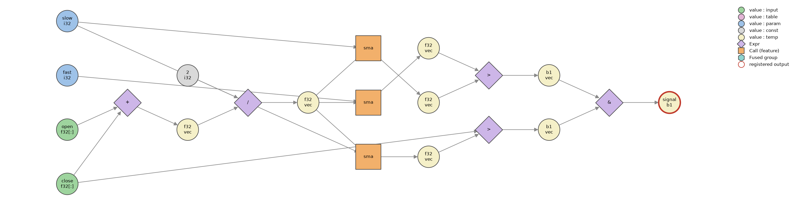

# KernelSmith

> Write trading strategies as Python expressions — compile them into fused CUDA kernels.

[](https://github.com/msanthosh247/KernelSmith/actions/workflows/ci.yml)

**Status: early development.** Phase 1 — the graph DSL and scheduling core — is under active work. The compiler passes and backends land next; the roadmap below is honest about what exists today.

## What it is

KernelSmith is a small compiler for Monte Carlo backtesting workloads: you describe a strategy once as a dataflow graph, and the compiler schedules it, plans its memory, and generates a fused GPU kernel that evaluates thousands of parameter combinations in parallel — one thread per parameter set, with buffer layouts chosen for coalesced access.

The graph is **value-centric SSA**: every value is created exactly once by its producer, which makes output overwrites and dependency cycles unrepresentable by construction — a whole class of framework bugs ruled out before any pass runs.

```python
from kernelsmith import Graph
from kernelsmith.backends.cpu import CpuBackend
from kernelsmith.features import sma

g = Graph()
close, opn = g.input("close"), g.input("open")
fast, slow = g.int_param("fast"), g.int_param("slow")

med    = (close + opn) / 2            # operators build typed graph nodes
signal = sma(med, fast) > sma(med, slow)
g.output("signal", signal)

program = CpuBackend().compile(g)     # schedules the graph, resolves implementations
out = program.run(
    inputs={"close": close_prices, "open": open_prices},
    params={"fast": [5, 10, 20], "slow": [20, 50, 100]},   # one thread per column, later
)
out["signal"].shape                   # (3, n_bars) - stacked along the parameter axis

g.visualize()                         # the plot below
```



Type errors fail at graph-build time with messages that say what you probably meant:

```
DslTypeError: '&' requires bool operands, got float32 and float32 - did you mean a comparison?
```

## Architecture

Five layers, imports only point downward:

| Layer | Contents | Status |
|---|---|---|
| `dsl` | typed value nodes, operator overloading, call factories, `Graph` | ✅ working |
| `ir` | passes: topological scheduling ✅, CSE ✅, liveness ✅, fusion, buffer allocation | 🔨 in progress |
| `backends` | CPU reference (test oracle) ✅, CUDA via numba, Triton (planned) | 🔨 in progress |
| `runtime` | memory planner, sessions, kernel cache | ⏳ |
| `backtest` | position sizers, portfolio sim, cost models — built *on* the compiler | ⏳ |

## Roadmap

- [x] Typed expression DSL (promotion lattice, build-time type errors)
- [x] Value-centric SSA graph with multi-output feature calls
- [x] Topological scheduling + dependency levels
- [x] Layered graph visualizer
- [x] CPU reference backend (every feature ships a numpy oracle; parity tests)
- [x] Common-subexpression elimination (commutative-aware, float-safe)
- [x] Liveness analysis and dead-value elimination
- [ ] Operator fusion
- [ ] Liveness-based buffer allocation
- [ ] CUDA backend (numba) with coalesced `(T, F, P)` layout
- [ ] Benchmarks vs. multiprocessing CPU baseline
- [ ] Triton backend

## Provenance

This is a from-scratch redesign ("v2") of a CUDA backtesting compiler I built professionally at a proprietary trading firm, where v1 remains in production. v2 is a clean reimplementation that fixes v1's design mistakes — uncoalesced memory layout, codegen coupled to backtesting semantics, manual output-index bookkeeping. Example strategies in this repo are deliberately naive: the project is the compiler, not the alpha.

## Development

```bash
pip install -e .[dev]
pytest
python examples/sma_crossover.py          # opens the graph plot
```

## License

Apache-2.0
